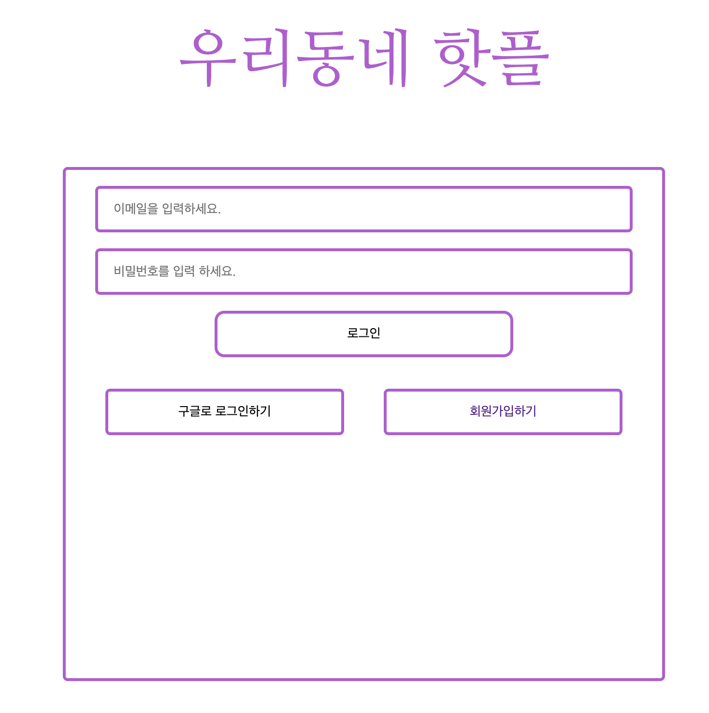
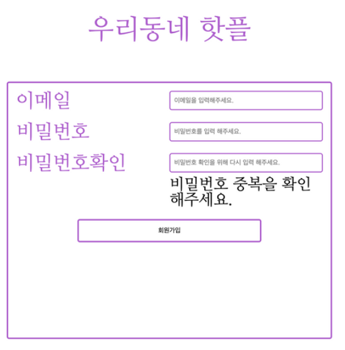
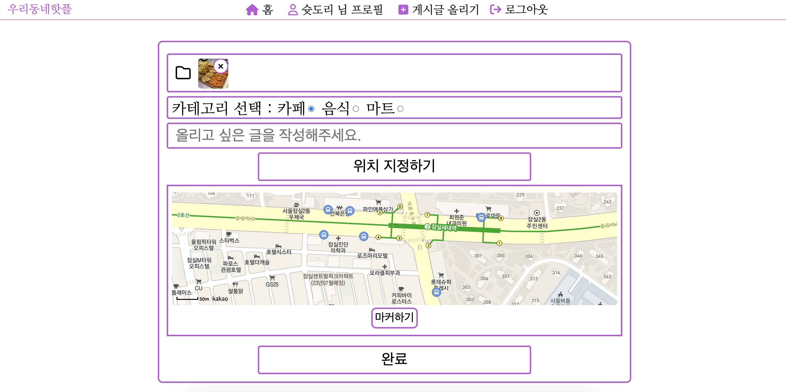
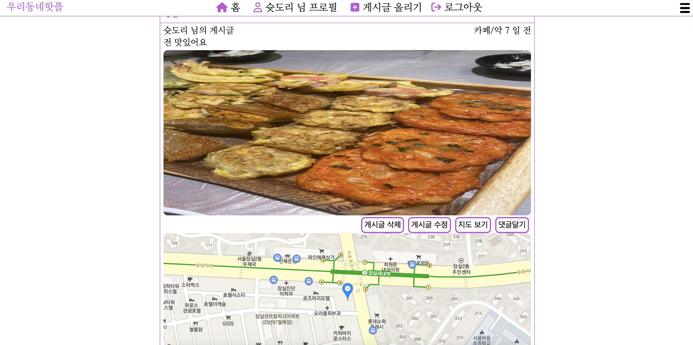
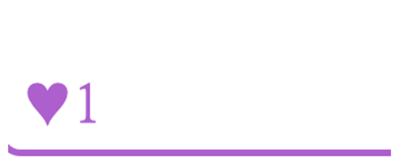
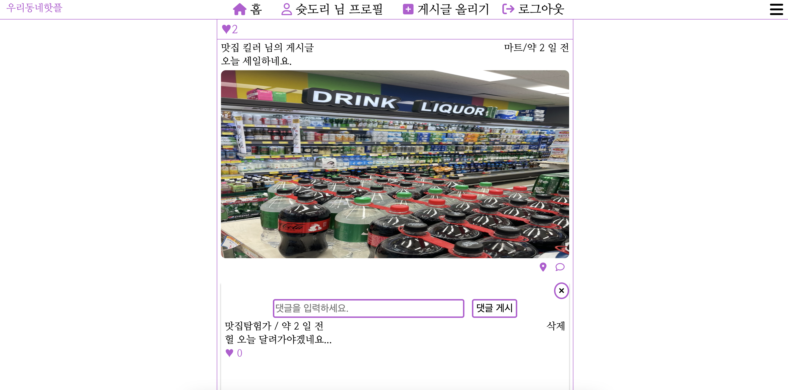
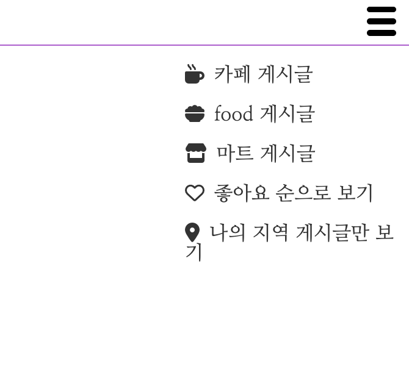

# 우리동네핫플

### 🔗  웹사이트 링크 : [https://hotplace-10bcb.web.app](https://hotplace-10bcb.web.app/#/)

### 사용한 기술

html, css, styled-components, react, react-router react-spinners, uuid, firebase

### 💁‍♂️  왜 만들었는가?

동네의 카페, 음식점, 마트 등을 한 번에 찾아볼 수 있고 사장님들도 본인의 매장을 홍보할 수 있는 애플리케이션이 있으면 좋겠다는 생각에 개발하였습니다.

### 애플리케이션 설명

사장님들 또는 손님이 직접 글을 게시하여 매장 글을 올릴 수 있으며 손님들의 진짜 의견을 위해서 게시글의 댓글 기능, 좋아요 기능을 만들어 손님들의 진짜 후기를 확인하여 매장을 선택해 방문할 수 있습니다.

누구나 우리 동네 맛집을 소개할 수 있는 애플리케이션입니다.

## 사용기술

- 프론트엔드 : html, css, styled-components, JavaScript, React.js, Recoil
- 백엔드 : firebase

### 어플리케이션 주요 기능

### 로그인 기능 : 로그인 기능입니다. 회원가입할 때 입력한 이메일과 비밀번호로 로그인할 수 있으며 구글 계정으로 연동해서 회원가입, 로그인할 수 있습니다.

### 회원가입 기능 : 구글 계정으로 로그인하지 않고 이메일과 비밀번호를 입력해 회원가입할 수 있습니다.

### 게시물 업로드 기능 : 사용자가 원하는 글을 게시할 수 있는 기능입니다. 하나의 사진을 첨부할 수 있고 올리는 게시글이 카페,음식,마트 관련인지 선택할 수 있습니다. 게시물들을 업로드하면서 남길 글을 작성할 수 있고 사용자가 올리는 글에서 소개하는 매장의 위치를 카카오 맵으로 마커를 남겨 업로드할 수 있습니다. 다른 사용자가 이 지도를 보고 해당 매장의 위치를 알 수 있게 됩니다.

### 게시물 지도보기 기능 : 게시물에서 지도 보기 버튼을 클릭하면 게시물을 작성한 사람이 마커 한 위치의 지도를 볼 수 있습니다.

### 게시물 좋아요 기능 : 게시물에 공감한다면 좋아요를 남길 수 있습니다. 게시글의 작성자든 게시글을 보는 사용자든 무분별한 좋아요를 막기 위해서 게시글 하나당 계정 하나의 좋아요만 남길 수 있습니다. 다시 클릭하면 좋아요는 취소됩니다.

### 게시글 댓글 기능 : 게시글에 댓글을 남길 수 있습니다. 게시글에 좋아요를 남길 수도 있고 댓글을 수정하거나 삭제 할 수도 있습니다. 좋아요는 게시글 좋아요와 마찬가지로 무분별한 좋아요를 방지하기 위해서 계정 하나당 하나의 댓글에 한 번의 좋아요만 남길 수 있습니다. 다시 클릭한다면 좋아요는 취소됩니다.

### 게시글 분류해서 보기 : 홈 화면에서 오른쪽 위에 햄버거 버튼을 클릭하면 게시글을 원하는 종류만 볼 수 있도록 하였습니다. 종류는 카페, 음식, 마트 관련 게시글만 보기, 좋아요가 가장 많은 게시글 순으로 보기, 내가 사는 지역 게시글만 보기 기능이 있습니다.

### 개발하면서 어려웠지만 좀 더 배웠던 부분

1. 혼자 개발의 힘든 점

개인 개발을 하여서 디자인, 기능 등 모두 제가 혼자 결정하고 구현하는 것이 쉽지 않았습니다. 잘 개발하는지도 모르겠고 어떤 기능을 중심적으로 개발해야 할지 잘 몰랐던 것 같습니다. 구글 검색이나 다른 분들이 만드신 것을 보면서 어느 정도 전체적인 그림을 그리는데 감을 잡을 수 있었습니다.

2. 모두에게 좋은 UX 를 제공하기

애플리케이션 사용자가 어떤 디바이스로 어떤 방법으로 웹사이트를 방문할지 모르기 때문에 모든 사용자에게 같은 UI 와 기능을 제공하고 훌륭한 UX 경험을 제공하는 것이 쉽지 않았습니다.

저는 모든 UI 를 styled-components를 사용했기 때문에 모든 컴포넌트가 다양한 디바이스, 브라우저 화면 크기에 따라서 반응해서 바뀌어야 했고 모든 상황을 고려해서 레이아웃을 반응하도록 하여 모두에게 최적의 웹사이트를 제공하도록 반응형 웹사이트를 제작하는 것이 목표였습니다. 반응형 웹사이트를 실습만 해봤지 아예 전부다 개발한것은 처음이라 많은 어려움을 겪었지만 자료를 찾아보고 직접 이것저것 시도해보며 완성하였고

반응형 웹사이트와 css 공부를 좀 더 디테일하게 공부할 수 있었습니다.

3. 현실에서 문제점을 해결하기
   실제 사용자들이 사용할 수 있는 애플리케이션을 개발해야 하기 때문에 현실의 문제점도 고려를 해야 했습니다.

사용자 중에서 손님, 사장님 모두 게시글을 올릴 수 있는데 사장님의 지인이나 사장님이 무분별하게 게시글을 많이 올려 다른 매장의 사장님들이 피해를 보게 되고 손님 입장의 사용자들도 애플리케이션에서 얻는 정보의 신뢰성이 떨어진다고 생각할 것 같아 게시글과 댓글에 모두 좋아요 기능을 넣었습니다. 그리고 좋아요에는 하나의 계정으로 하나의 게시글에 한개 , 하나의 댓글에 하나의 좋아요만 남길 수 있도록 하였습니다. 조금이나마 사용자가 좋아요 개수를 보고 신뢰성을 가지고 매장을 방문할 수 있도록 하였습니다.

4. 애플리케이션의 전역 state 를 관리하기
   해당 애플리케이션에는 Recoil 을 사용하였습니다. Recoil 을 선택한 이유는 React 와 가장 유사한 상태 관리 라이브러리라서 완전 새로운 개념을 공부 할 필요가 없었고 Redux 보다 작성 할 코드가 매우 적었기 때문입니다.
   막상 전역 상태로 관리 할 상태들을 뭐가 있을까 찾아보니 먼저 현재 애플리케이션을 사용하고 있는 user 의 정보를 담은 객체 말고는 딱히 전역 상태로 관리 할 상태가 있나? 라는 생각이 들었습니다.
   전역 상태로 관리할려고 했던 상태가 user 객체 말고 또 있었는데 비동기로 데이터베이스의 정보를 가지고와서 그 데이터를 상태로 관리하고 그 상태의 각각의 요소를 post 컴포넌트에 전달 해서 해당 데이터를 사용해 게시물을 렌더링하게 되는데 데이터베이스에서 가지고 온 데이터를 전역 상태로 관리 해봤자 각각의 post 컴포넌트들은 전역 상태의 각각의 요소들을 사용하고 있기 때문에 post 컴포넌트에서 전역 상태 전체를 가져다 쓸 일이 없다는 생각이 들었습니다. 결론적으로 해당 데이터를 전역 상태로 관리할 필요가 있을까 라는 생각이 들어 해당 데이터는 전역 상태로 관리하지 않았습니다.

애플리케이션을 개발하면서 해당 애플리케이션에 어떤 상태 관리 라이브러리가 적합할지 고민해보고 조금씩 공부도 해보는 시간이 되었고 상태 관리 라이브러리를 꼭 사용해야 할까? 라는 고민도 해보는 기회가 되었습니다.
