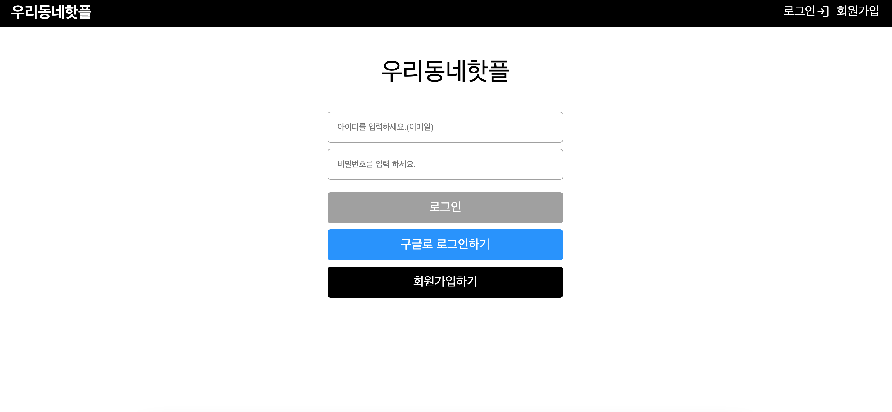
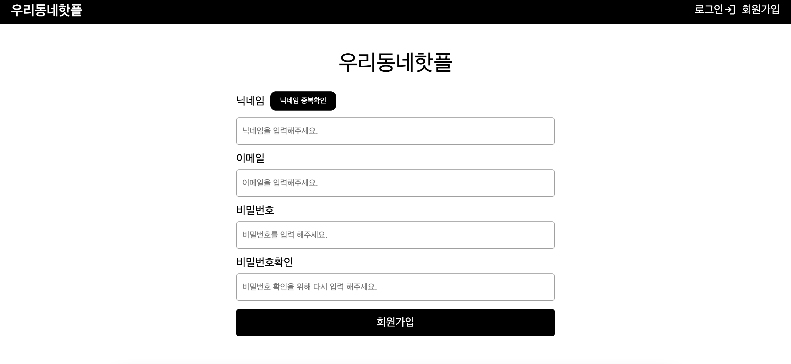
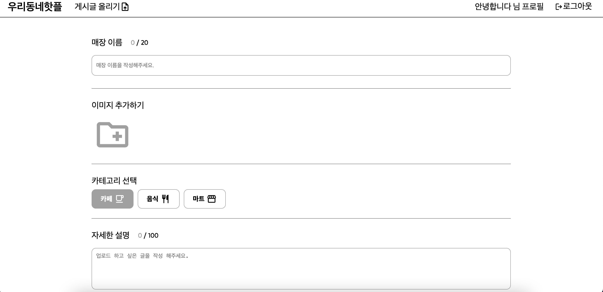
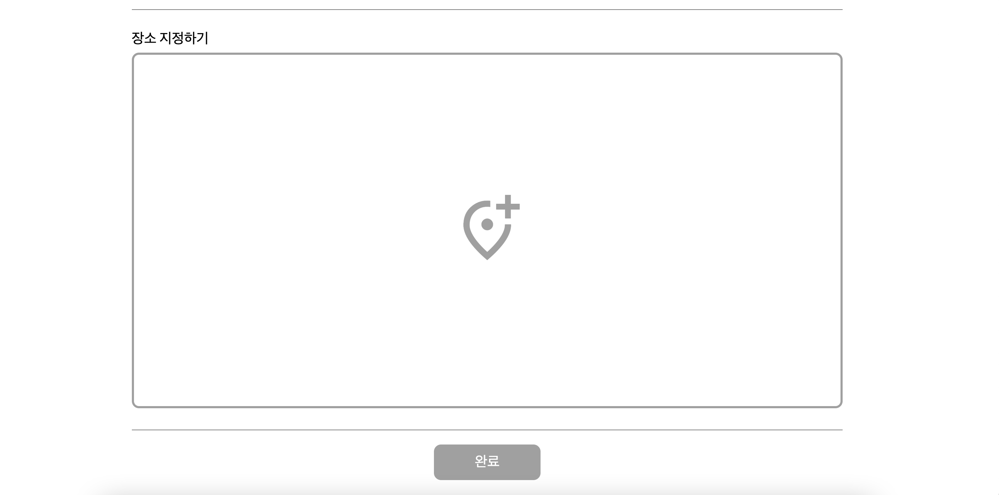
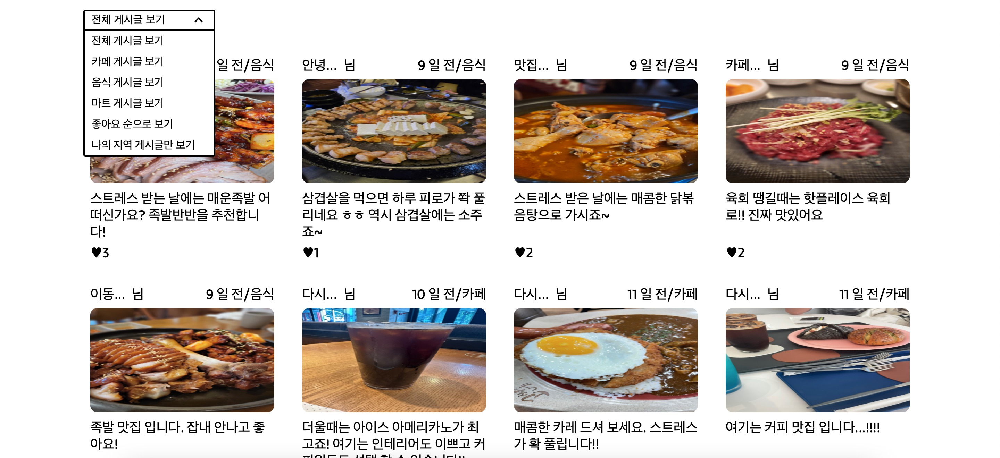

# 우리동네핫플

### 🔗  웹사이트 링크 : [https://hotplace-10bcb.web.app](https://hotplace-10bcb.web.app/#/)

### 사용한 기술

html, css, styled-components, javascript, react, react-router react-spinners, uuid, firebase, recoil, recoil-persist

### 💁‍♂️  왜 만들었는가?

맛집 또는 카페를 좋아하는 나에게는 항상 이곳저곳 플랫폼에서 찾아보고 캡쳐해두는것이 생각보다 불편했습니다, 그리고 우연히 들어간 카페나 음식점이 내 인생 카페, 맛집이 되는 경우도 있었죠. 이렇게 내가 사는 동네 또는 내가 방문 할 동네의 카페, 맛집, 마트등을 직접 소개하고 소개 된 매장이 맘에 들면 좋아요를 눌러 두고 마이 프로필 페이지에서 확인하여 방문 할 수 있는 서비스를 만들고 싶었습니다.
추후에는 매장 사장님들이 직접 본인의 매장을 소개하고 홍보하는 페이지도 만들 예정 입니다.

### 애플리케이션 설명

유저가 직접 글을 게시하여 매장 소개 글을 올릴 수 있으며 유저들의 진짜 의견을 위해서 게시글의 댓글 기능, 좋아요 기능을 만들어 손님들의 진짜 후기를 확인하여 매장을 선택해 방문할 수 있습니다. 그리고 좋아요 기능으로 마이 프로필 페이지에서 좋아요를 눌러 둔 매장을 확인 할 수 있습니다.

사람들이 좋아요를 클릭한 개수의 10위까지 한눈에 확인 할 수 있습니다. 해당 기능으로 인해서 어디가 요즘 사람들에게 인기가 많은지 알 수 있습니다.

그리고 드롭다운 기능으로 내가 원하는대로 분류해서 매장을 볼 수 있습니다.

누구나 우리 동네의 맛집, 카페, 마트 등을 소개 또는 홍보 할 수 있는 서비스 입니다.

### 어플리케이션 주요 기능

### 로그인 기능 : 로그인 기능입니다. 회원가입할 때 입력한 이메일과 비밀번호로 로그인할 수 있으며 구글 계정으로 연동해서 회원가입, 로그인할 수 있습니다.

### 회원가입 기능 : 구글 계정으로 로그인하지 않고 이메일과 비밀번호를 입력해 회원가입할 수 있습니다.

### 게시물 업로드 기능 : 사용자가 원하는 글을 게시할 수 있는 기능입니다. 하나의 사진을 첨부할 수 있고 올리는 게시글이 카페,음식,마트 관련인지 선택할 수 있습니다. 게시물들을 업로드하면서 소개 글을 작성할 수 있고 사용자가 올리는 매장의 위치를 카카오 맵으로 마커를 남겨 업로드할 수 있습니다. 다른 사용자가 게시글의 디테일 페이지에서 이 지도를 보고 해당 매장의 위치를 알 수 있게 됩니다.

### 게시물 좋아요 기능 : 게시물에 공감한다면 좋아요를 남길 수 있습니다. 게시글의 작성자든 게시글을 보는 사용자든 무분별한 좋아요를 막기 위해서 게시글 하나당 계정 하나의 좋아요만 남길 수 있습니다. 다시 클릭하면 좋아요는 취소됩니다. 좋아요는 사용자가 좋아요를 클릭하면 마이 페이지에서 좋아요를 한 게시글을 확인 할 수 있습니다.

### 게시글 댓글 기능 : 게시글에 댓글을 남길 수 있습니다. 게시글에 좋아요를 남길 수도 있고 댓글을 수정하거나 삭제 할 수도 있습니다. 좋아요는 게시글 좋아요와 마찬가지로 무분별한 좋아요를 방지하기 위해서 계정 하나당 하나의 댓글에 한 번의 좋아요만 남길 수 있습니다. 다시 클릭한다면 좋아요는 취소됩니다.

### 게시글 분류해서 보기 : 드롭다운을 이용해서 사용자가 원하는 게시글만 볼 수 있는 기능 입니다. 추후에 게시글이 많아지게 되면 사용자가 원하는 게시글만 볼 수 있어 시간을 아낄 수 있습니다.

### 좋아요 top10 슬라이드로 보기 : 사용자가 좋아요한 게시글의 10위까지의 게시글을 한눈에 확인 할 수 있습니다.

### 개발하면서 어려웠지만 좀 더 배웠던 부분

1. 혼자 개발의 힘든 점

개인 개발을 하여서 디자인, 기능 등 모두 제가 혼자 결정하고 구현하는 것이 쉽지 않았습니다. 잘 개발하는지도 모르겠고 어떤 기능을 중심적으로 개발해야 할지 잘 몰랐던 것 같습니다. 구글 검색이나 다른 분들이 만드신 것을 보면서 어느 정도 전체적인 그림을 그리는데 감을 잡을 수 있었습니다.

2. 모두에게 좋은 사용자 경험을 제공 할 수 있는지에 대한 고민의 기회

서비스를 만들면서 내가 사용하고 싶은 서비스를 만들다 보니까 좀 더 사용하기 쉬운 UI 를 만드는것에 많은 고민을 했고 좀 더 사용자에게 더 좋은 사용자 경험을 제공하는 서비스를 만들기 위해서 이것저것 시도를 해봐서 좀 더 사용자에게 좋은 경험을 주는 서비스를 만드는 기회가 되었습니다.

3. 현실에서 문제점을 해결하기
   실제 사용자들이 사용할 수 있는 애플리케이션을 개발해야 하기 때문에 현실의 문제점도 고려를 해야 했습니다.
   사용자 중에서 손님, 사장님 모두 게시글을 올릴 수 있는데 사장님의 지인이나 사장님이 무분별하게 게시글을 많이 올려 다른 매장의 사장님들이 피해를 보게 되고 손님 입장의 사용자들도 애플리케이션에서 얻는 정보의 신뢰성이 떨어진다고 생각할 것 같아 게시글과 댓글에 모두 좋아요 기능을 넣었습니다. 그리고 좋아요에는 하나의 계정으로 하나의 게시글에 한개 , 하나의 댓글에 하나의 좋아요만 남길 수 있도록 하였습니다. 조금이나마 사용자가 좋아요 개수를 보고 신뢰성을 가지고 매장을 방문할 수 있도록 하였습니다.

4. 애플리케이션의 전역 state 를 관리하기
   해당 애플리케이션에는 Recoil 을 사용하였습니다. Recoil 을 선택한 이유는 React 와 가장 유사한 상태 관리 라이브러리라서 완전 새로운 개념을 공부 할 필요가 없었고 Redux 보다 작성 할 코드가 매우 적었기 때문입니다.
   막상 전역 상태로 관리 할 상태들을 뭐가 있을까 찾아보니 먼저 현재 애플리케이션을 사용하고 있는 user 의 정보를 담은 객체 말고는 딱히 전역 상태로 관리 할 상태가 있나? 라는 생각이 들었습니다.
   아직 몇개의 전역 상태가 아니면 불가능한 상태 빼고는 전역 상태 라이브러리를 꼭 사용해야 하는 필요성을 못 느끼고 있기 때문에 좀 더 공부하고 다양한 프로젝트를 만들어 봐야 할 것 같습니다.
